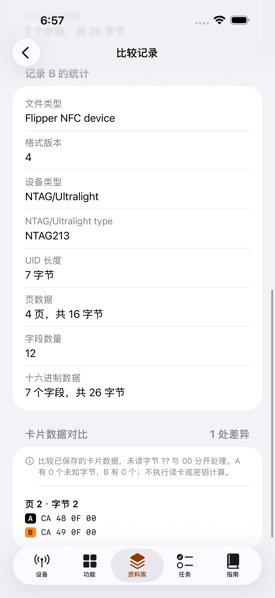
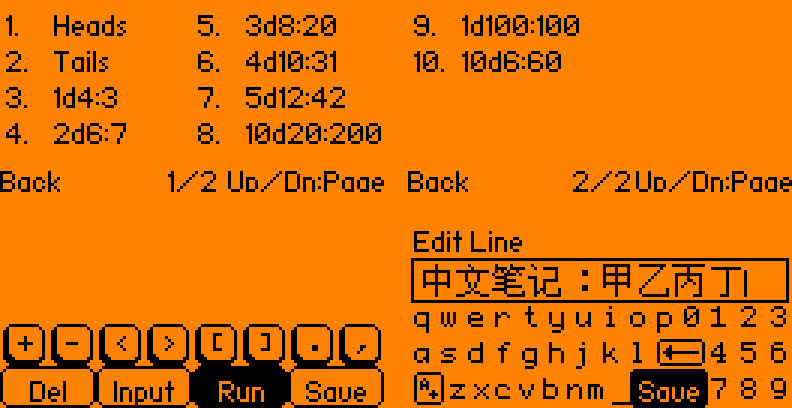

# 本机英文、手机中文（2026-09-30）

用户已将语言目标改为：**Flipper 本机恢复英文，保留功能升级；iPhone 通过蓝牙使用中文名称、功能介绍和操作界面。**此前的本机“中文全覆盖”目标及其剩余翻译清单不再作为当前验收要求。历史实现记录仍保留，功能融合与硬件验收继续进行。

全部修改交付至 [草稿 PR #1](https://github.com/Fairank/Flipper-Momentum-Lab/pull/1) 的 `codex/iphone-zh-architecture` 分支；尚未合并到默认分支，没有已签名 IPA。

## 设备语言恢复与功能保留

- 已发布恢复 2,167 处有固定上游出处的 C 文案及 85 处新增文案，合计 2,252 处，不回退整份源文件。另有 105 处上游 APDU 应用原有中文只产生了本地翻译备份，未发布；固定外部子模块保持原样。
- 27 个应用显示名称、23 份应用介绍恢复英文，22 份海豚动画元数据恢复原英文对白与坐标。未改动画帧、帧率、时序或图片。
- Flipper Lab 的 10 个主题、56 页帮助改为英文，保留主题顺序、启动名称、页面与行数。每个 UI 字符串为 ASCII 且不超过 19 字符；字库生成器用真实字形验证画面边界。
- 菜单别名和存储错误的显示函数返回原英文名称。旧中文映射只作为未启用的兼容元数据保留；蓝牙命令、协议字段、应用标识和路径不翻译。
- 合并后的 12 个菜单样式仍保持原编号；修正恢复英文时六个名称错位。FindMy 的间隔标签缩为 `Interval`，保持广播行为和数值不变。
- 累计导入的 24 个应用、菜单样式、快捷设置、床头时钟、手机 GPS／网络代理、Lab Bridge 串口通道和已有协议适配保留。记事本的 UTF-8、文件保护、故障回滚，数独存档兼容与掷骰分页修复保留。

独立核对 352 个已发布的非生成 C／头文件：与恢复前相比，所有非字符串语法 token 完全相同，明确例外只有显示别名函数的两处返回值。应用清单只修改名称及说明等显示字段。SD 中文字库保留供用户文件及固定上游 APDU 中文使用；英文 UI 不要求把用户的中文文件名或笔记改成英文。帮助字库为 1,094 字节，升级器的空 CJK 子集为 31 字节。干净检出的完整扫描参考子集为 265 字形／7,197 字节，不链接到主固件；实际无卡子集仍为 125 字形／3,450 字节。首次未同步完整参考子集的本地包不作为当前交付包。

## 手机中文与蓝牙应用发现

手机五页导航保留苹果原生控件及 Flipper 橙黑风格。内置功能、应用分类、设备信息和错误说明使用中文；已核对的安装应用映射由 28 项增为 31 项，包含计算器、音乐播放器和 WAV 播放器的功能介绍。未知文件名、设备标识、协议名和原始数据保留原值。

之前只扫描 `/ext/apps` 和下一层，遗漏了更深目录的应用。本轮改为逐目录读取，允许最多四层分类目录，设定 128 个目录、12,000 条条目和 600 个应用的边界。拒绝路径越界、目录响应错配和非法文件名；取消、断连或会话变化时不提交旧结果。点击中文入口仍使用实际发现的 `.fap` 路径，启动白名单不接受任意输入路径。代码和自动测试通过，真实 BLE 发现与逐应用启动仍待实物验收。

系统文件导入、导出及蓝牙／网络错误经过中文展示转换；原始错误对象、取消逻辑和操作流程保留。

## 已保存 NFC 记录的结构化比较

资料库中选择两份 NFC 记录，按字段、块或页定位差异，并显示变化字节。支持 MIFARE Classic、NTAG／Ultralight、ST25TB 和部分 ISO14443 UID／头信息文件。重排字段、注释、大小写及换行形式不会造成假差异；未读字节 `??` 与 `00` 分开处理。

重复字段、编号冲突、非法字节、越界编号和截断记录会明确报错。最多显示 200 项差异，但计数与校验覆盖完整输入。FeliCa 和 DESFire 的多层结构暂不支持，明确报错，不作为平面字节数据误读。

这项比较处理保存文件，不读卡或计算密钥。既有 Classic 离线工作台仍用于两组认证样本的密钥恢复、字典验证、合并与导出；普通 `.nfc` 文件不能代替认证样本。

## 当前验证与预览

手机代码 `c05884a04` 首次 CI 出现两类测试问题：两份样本来自本机未跟踪目录，另一个界面测试漏了 `@MainActor`。修订 `7b6069e3b12686770a6ca9a98e63881031c123dd` 将样本改为两份明确标注的合成测试文件，保留七份已跟踪公共样本及全部断言，并恢复线程标记。

[手机验证运行 36680614661](https://github.com/Fairank/Flipper-Momentum-Lab/actions/runs/36680614661) 已通过：129 项主机测试、178 项 Swift 核心测试、iOS 模拟器编译、7 项界面测试。核心测试 8.779 秒，界面测试 256.184 秒，包含新 NFC 页面差异定位测试。后续英文设备与错误展示修改的验收结果另以 [验证记录](VALIDATION.md) 和当前 PR 检查为准。

英文设备源码的本机全量回归为 129 项、38.048 秒、无跳过。Windows 测试进程曾在退出时偶发丢失缓冲 stdout，连不运行缓存工作线程的 `--list` 也能复现；只将测试 harness 的 stdout 设为不缓冲，保留全部 PASS、字节和行为断言，没有添加重试或修改生产缓存代码。

下图手机为通过测试的 iPhone 17 Pro Max 模拟器原始截图，Flipper 为实际源码绘制预览，均不是真机 BLE／AIO 验收证据。手机截图附件 [11082166883](https://github.com/Fairank/Flipper-Momentum-Lab/actions/runs/36680614661/artifacts/11082166883) 含 25 张原图，ZIP 为 8,291,803 字节，SHA-256 `9900889f8235881b2d2f28756e66558f0736ec843eab45613e9671b01d7d95a5`；展示文件逐字节复制，来源见相邻 `phone-manifest.json`。

记事本示例的中文内容是用户输入样本，标题与保存按钮已为英文；保留中文输入内容的显示能力。四张应用预览及源码摘要见相邻 `manifest.json`。英文帮助可由 `scripts/render_lab_preview.py --all` 重现 66 个菜单／页面画面。

## 分工与仍待验收事项

本轮 CLI 均精确请求并实际返回 `claude-fable-5-1`，使用 `--effort max`；主助手审核后采纳：

| 边界清楚的工作 | 实际状态 |
| --- | --- |
| NFC 比较的 8 项测试 | 成功，退出 0，980.9 秒；Mac 重跑全部通过 |
| 剩余设备英文文案数据 | 成功，退出 0，1,465.0 秒；主助手核对格式参数、语义与短屏排版后应用 |
| 英文 Flipper Lab 帮助 | 成功，退出 0，2,465.8 秒；主助手修订能力措辞并运行布局生成检查 |
| 早期本机中文任务 | 用户改变语言目标后取消，退出 130，453.2 秒；未采纳输出 |
| 手机展示基础任务 | 退出 4294967295，512.1 秒，未产出可采纳修改；由协作助手完成，主助手审核 |

关键比较校验、目录发现边界、会话隔离、恢复方式及最终验收由主助手决定。没有静默更换模型，也没有把 CLI 成功当作代码测试通过。

Momentum／Unleashed 的完整功能并集仍未完成；固定参考中的 232 项匹配源码差异、134 项未匹配应用和 19 项未匹配插件清单保留。本轮语言切换不意味着这些功能已经补齐。真实蓝牙配对、文件往返、逐应用启动、手机 GPS／网络代理和 AIO Board 1.4 的 UART／无线链路仍待验收。AIO 的厂商、芯片丝印与现装固件未知；通用接收桥不能代替未知板卡的专用驱动。本轮没有新增定向 Wi-Fi 断链控制。
