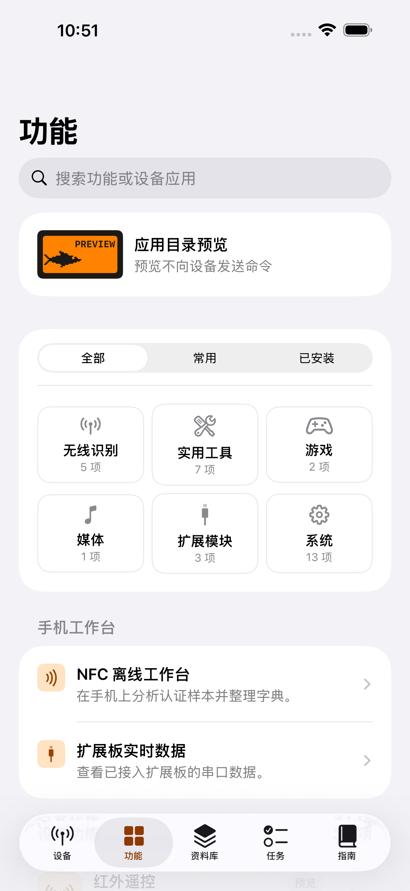
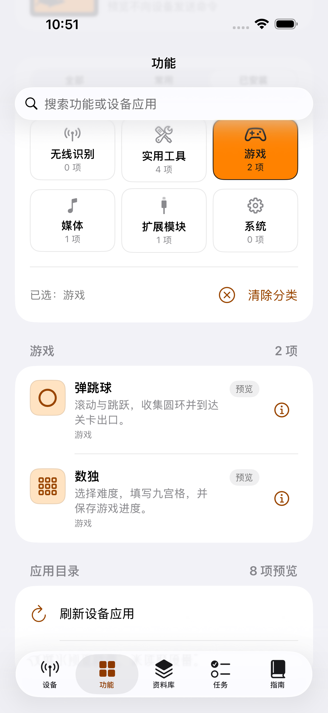
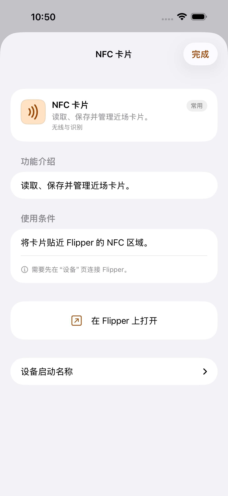
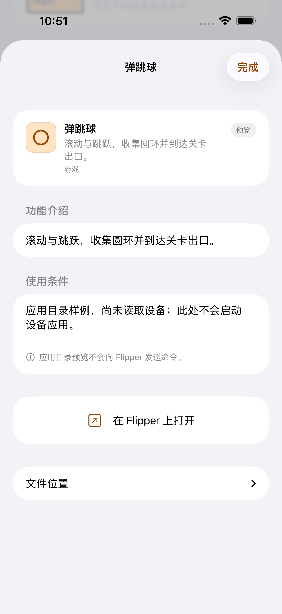
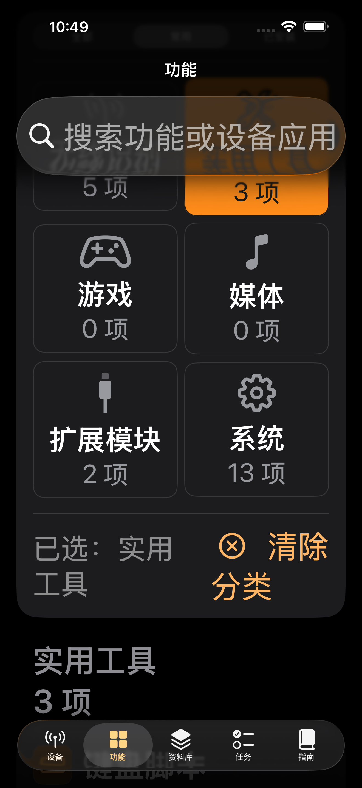
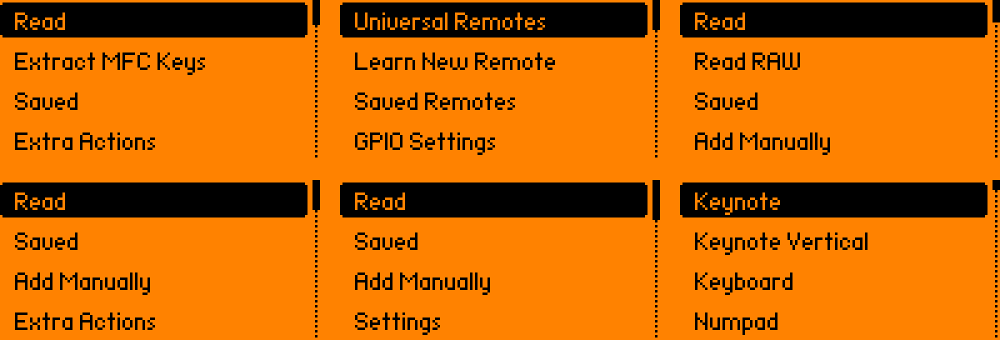
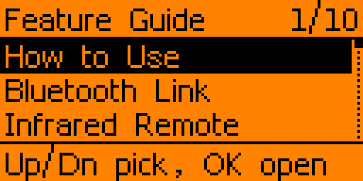

# 中文手机应用目录与连接恢复

**历史自建手机App记录：**本页手机代码与原图固定于 `1dbdd4a2`，英文设备原图固定于 `65c05a20`。用户随后决定暂停自建手机UI，当前优先适配官方App，见 [兼容说明](OFFICIAL_APP_COMPATIBILITY_20260930.md)。这里的独立中文页面、不自动进入镜像和手机能力处理只属于自建App；不能作为官方App界面或当前设备源码的截图证明。

本轮按用户要求参考官方 Flipper iOS App 的应用浏览和 BLE／RPC 实现。Flipper 本机继续使用英文；手机保留自己的中文页面，选择条目直接让设备打开应用，手机不自动切换到屏幕镜像。

## 应用目录

- 原生搜索栏和“全部／常用／已安装”来源选择；分类卡片显示当前来源与关键词下的数量。分类和搜索同时生效，支持中文介绍、原英文启动名称和多词搜索。
- 分类包含无线识别、实用工具、游戏、媒体、扩展模块和系统；未知目录归为其他应用。筛选不改 ID／真实启动路径，同名但不同位置的应用都保留。
- 应用行使用橙色图标、中文名称、简短介绍和来源标记。独立信息按钮打开详细介绍及使用条件，文件位置收在详情里。
- 手机 NFC 离线工作台和串口接收入口也参与搜索，但不会伪装成可发给设备的应用启动路径。
- 已安装条目来自当前连接读取到的 SD 卡；切换设备／断连会失效旧目录。旧会话或旧请求完成后不能覆盖新目录，切换标签不会取消正在进行的目录读取。连接恢复后重新读取应用。
- 深色模式、大字和 VoiceOver 保留系统语义；大字分类改为两列，说明自然换行，按钮至少 44 点。
- 搜索页底部提供中文“结束搜索”，清空关键词并通过系统 [searchable(isPresented:)](https://developer.apple.com/documentation/swiftui/view/searchable%28text%3AisPresented%3Aplacement%3Aprompt%3A%29) 关闭搜索；空关键词不依赖已禁用的回车键，也不假定系统“×”关闭控件的中文无障碍标签。操作放在页面安全区域，避免依赖搜索栏的键盘工具栏挂载。

DEBUG 参数 `-ui-testing-app-catalog` 只提供八项界面预览，状态和徽标明确写“预览”；它不改连接状态、不建立设备启动白名单，也不发送蓝牙命令。Release 构建没有这个目录。预览测试不等于设备安装验收。

## 连接与任务

仅对曾成功就绪、当前仍在前台的设备意外断连尝试恢复连接。最多三次，分别等待 1、3、6 秒。首次配对失败、主动断开、取消任务、关闭蓝牙、退到后台及协议不兼容不会自动重试。恢复失败后由用户重新操作。

每次恢复先结束旧会话、完成旧请求的失败返回，清掉发送队列、解码缓冲、流控、应用启动白名单与串口状态。随后重新发现特征、订阅、获取流控和进行 RPC 版本／设备信息检查。旧启动、写文件、红外执行和串口操作不会自动重发。多步骤操作绑定最初的会话；旧操作异常不能断开新连接。

保留当前的单请求互斥、有界发送队列、45 秒无进展超时和 600 秒绝对期限。分包按实际 `.withResponse` 写入能力及固件容量计算，不能照搬官方取另一写入方式 MTU 的细节。蓝牙回调增加状态及当前特征对象校验；相同设备快速重连的真实回调顺序仍需硬件测试。

官方 `restartSession()` 写一个零字节 `Data([0])`，不是零长度数据。我们固定固件的对应事件会重启蓝牙栈并物理断连，本轮没有加入这个重启操作，也没有把它当作仅清空 RPC 缓冲的恢复办法。官方串行队列的关闭行为也没有直接复制。

## 参考与分工

### 使用官方手机 App

本固件保留标准BLE串口、protobuf 0.29、设备信息、文件管理、App.Start、屏幕流和虚拟按键接口。对照固定官方App源码，协议版本处于它接受的范围内，基础连接、资料同步及屏幕遥控预计兼容；这是源码核对结论，没有官方App与本固件的真机验收。普通新增应用通常可经屏幕遥控操作，但不自动获得独立手机页面；自建NFC工作台、Lab Bridge、GPS和网络共享也不会自动出现在官方App。

官方应用目录按设备目标与API版本请求构建；我们使用API89.0，目录可见性和官方编译应用仍需逐项核对，不能因蓝牙兼容就声明全部商店应用兼容。官方固件更新入口默认提供官方渠道，安装前应确认所选包，避免覆盖定制功能。手机可以安装两套App，切换使用时先断开另一套连接。参考 [官方手机App说明](https://docs.flipper.net/zero/mobile-app) 和固定 [应用管理源码](https://github.com/flipperdevices/Flipper-iOS-App/blob/46074e4c92895ab566a3ef5c599f066b1d507063/Flipper/Packages/Core/Sources/Applications/Applications.swift)。

官方App可从 [App Store](https://apps.apple.com/us/app/flipper-mobile-app/id1534655259) 直接安装。我们自建的中文App目前仍只有源码，需要Mac和个人Apple ID签名；两者的安装方式不同。

官方只读参考固定为 [Flipper-iOS-App 46074e4c](https://github.com/flipperdevices/Flipper-iOS-App/tree/46074e4c92895ab566a3ef5c599f066b1d507063)，MIT 许可。应用浏览参考 [AppsView](https://github.com/flipperdevices/Flipper-iOS-App/blob/46074e4c92895ab566a3ef5c599f066b1d507063/Flipper/iOS/UI/Apps/AppsView.swift)，连接参考 [FlipperPeripheral](https://github.com/flipperdevices/Flipper-iOS-App/blob/46074e4c92895ab566a3ef5c599f066b1d507063/Flipper/Packages/Peripheral/Sources/Bluetooth/Platform/FlipperPeripheral.swift)、[Device](https://github.com/flipperdevices/Flipper-iOS-App/blob/46074e4c92895ab566a3ef5c599f066b1d507063/Flipper/Packages/Core/Sources/Model/Device.swift) 和 [RPC Session](https://github.com/flipperdevices/Flipper-iOS-App/blob/46074e4c92895ab566a3ef5c599f066b1d507063/Flipper/Packages/Peripheral/Sources/RPC/Session/FlipperSession.swift)。本轮没有复制官方图片资产或整个实现。

本地 Claude 按主助手给定规格实现两个纯展示组件，通过 CLI 精确请求并返回 `claude-fable-5-1 --effort max`。重试任务成功，退出 0，841.2 秒；首次调用没有结束事件或交付文件，退出状态未知，不算完成。主助手审核并去掉无限高度约束；筛选、会话恢复、多步控制与真实结果验收由主助手决定，协作助手补写测试并交叉检查。

## 验收状态

最终代码 **`1dbdd4a2fe1e8212c46ce42e71ec5ee3fc28a111`** 的 [Mac与主机CI](https://github.com/Fairank/Flipper-Momentum-Lab/actions/runs/36703025197) 全部通过：196项Swift核心（12.834秒）、129项主机／C回归（15.836秒）、字库检查、准备模式与模拟器构建，以及10项UI（650.853秒）。本轮增加的12项目录核心、6项有限重连策略与3项目录界面测试均在其中，原有测试全部保留；真实中文空结果、键盘退出与恢复设备入口均已验证。后续提交仅补说明、原图与来源证据，不修改该已验证代码。完整记录见 [VALIDATION](VALIDATION.md) 和 [JSON证据](OFFICIAL_APP_REFINEMENT_20260930.json)。

本轮新增12项目录核心、6项重连策略及3项界面测试。代码`65c05a20`的10项UI中9项通过，清空搜索后键盘没有退出；`4a350978`的10项中8项通过，系统没有测试所假定的中文“取消”按钮，另一次深色大字任务标签点击未切换页面。保留全部页面与选中断言，增加真实中文结束搜索，并将任务点击落在可见图标区域。`ec6284b6`的验证被后续提交取消，不作为通过证据；`1715e344`为9／10，原录屏显示键盘确已退出，而断言抢在动画结束前读取。`72009a60`增加最多5秒状态等待后，键盘退出和红外恢复通过，剩下的9／10失败定位为空结果装饰图标；原录屏中的中文提示正常显示，`1dbdd4a2fe1e8212c46ce42e71ec5ee3fc28a111`改为检查实际可见中文StaticText。没有重复点击、重启App或删掉功能／恢复断言。最终检查见 [验证记录](VALIDATION.md)，此前178项核心／7项UI不能当作新版通过。

英文恢复的固定子模块／字库修订为 `85e08bc325fe5aef872fd99a59ab1c58feb59bf9`；本地重新执行 129 项主机／实际 C 测试通过，35.587 秒、无跳过。首次本地重跑遗漏既有 UTF-8 环境配置导致四项失败，恢复与 CI 相同的配置后通过，没有改断言。重新生成的完整扫描参考字库为 265 字形／7,197 字节，不链接到主固件；实际无卡字库仍为 125 字形／3,450 字节。

最终 `1dbdd4a2` 的 [固件构建](https://github.com/Fairank/Flipper-Momentum-Lab/actions/runs/36703025418) 与 [Lint](https://github.com/Fairank/Flipper-Momentum-Lab/actions/runs/36703025291) 通过。下载包另核验为主固件868,800字节、保留区前余11,840字节、升级器120,217字节；DFU地址／CRC、295 FAP／121 FAL、28项指定应用、API89及资源一致性通过。升级TGZ为13,005,998字节，SHA-256 `ef0fc121c55ca62b8042cf727950fc32078b30090dc2defa689840d613e7f391`。手机提示修订没有改动设备固件源码；本地英文恢复包尺寸与历史云端包另见 [验证记录](VALIDATION.md)，不混作相同附件。

没有真机 BLE、AIO 或逐应用控制验收；完整 Momentum／Unleashed 功能并集仍未完成。更新后仍需 Mac 签名安装，未生成可直接下载的已签名 IPA。

## 页面原图

以下手机图是最新全套测试通过后从iPhone 17 Pro Max模拟器xcresult原样复制的PNG，没有裁剪或重绘。“目录预览”及“已安装游戏”使用明确标记的DEBUG展示样例；其他手机图处于未连接设备的离线状态，均不证明真实蓝牙控制。每张图的来源、测试名与SHA-256见 [手机原图清单](previews/official-app-20260930/phone-manifest.json)。

| 离线功能中心 | 中文应用目录样例 | 已安装游戏筛选样例 |
| --- | --- | --- |
|  |  |  |

| NFC功能介绍 | 游戏说明样例 | 深色与大字分类 |
| --- | --- | --- |
|  |  |  |

[结束搜索后恢复设备功能的原图](previews/official-app-20260930/phone-search-ended.png) 保留键盘退出后的实际页面状态。

Flipper图来自固定生产C代码与英文帮助资源的CI源码绘制，不是真机截图；源版本为`65c05a20`，截至本页历史轮次`1dbdd4a2`未改变对应设备源码。新的官方App适配轮次已增加Phone Remote指南及加载器修复，这些旧图不展示新改动。原图及哈希见 [设备预览清单](previews/official-app-20260930/flipper-manifest.json)。

