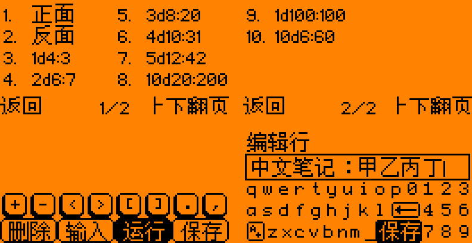
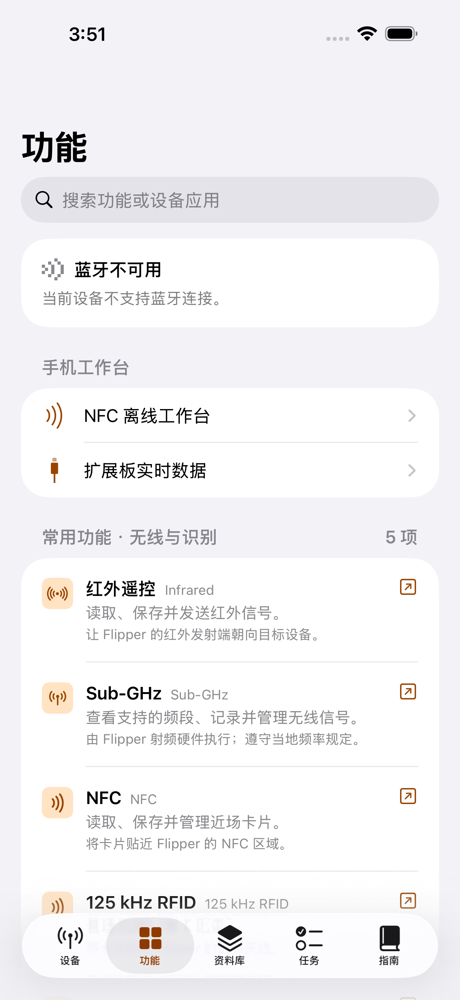
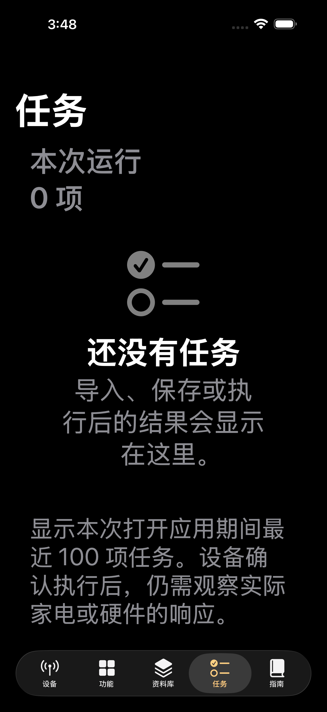

# 中文界面与第三方应用：第四轮（2026-09-30）

接续代码基线 `e3c8cfaf`，继续在 [草稿 PR #1](https://github.com/Fairank/Flipper-Momentum-Lab/pull/1) 的 `codex/iphone-zh-architecture` 分支工作。应用与固件代码为 `12b8c35f3`，存储回归及手机比较入口修订为 `6f94bdc9d`。本轮增加四个可编译应用，继续补中文按钮和文字编辑正确性；**仍未达到中文全覆盖或 Momentum/Unleashed 的完整功能并集**。提交、自动测试和安装附件以 [验证记录](VALIDATION.md) 本轮段落为准，逐文件摘要与实际模型状态见 [JSON 记录](UNION_CHINESE_20260930.json)。

## 新增应用

从固定 [all-the-plugins 提交 `eb87c158`](https://github.com/xMasterX/all-the-plugins/tree/eb87c158c7dbc930d74c3ae3ccb6b59cad5fc833) 的 Git 对象恢复完整目录，而非只复制 C 文件：22 个原始文件，包括菜单图标、四份应用许可证、游戏地图与渲染代码。原始摘要见 [UPSTREAM.json](../../applications/union/UPSTREAM.json)。本轮适配另由 Git 差异记录。

| 应用 | 安装路径 | 功能与适配 |
| --- | --- | --- |
| 弹跳球 | `apps/Games/bounce.fap` | 八个关卡、跳跃、圆环收集、存档和音效；菜单、关卡名、暂停与结果界面中文化，保留地图与玩法。紧凑 HUD 保留图标和数字，说明页介绍其含义 |
| 方块搬运 | `apps/Games/stack_attack.fap` | 原版/快速模式、高分、音效、灯效与振动；标题按钮、设置、暂停、结束弹窗按中文字形重新布置 |
| 数独 | `apps/Games/sudoku.fap` | 竖屏棋盘、三种难度和进度保存；中文菜单使用独立字体与 14 像素行高。修复初始化及退出生命周期，存档改用明确的 89 字节 v3 格式 |
| 昵称生成器 | `apps/Tools/nickname_generator.fap` | 三类词表随机组合；中文分类与操作提示，保留字母昵称作为生成内容。生成移入主循环，绘图与状态变更使用互斥锁，通知服务在退出时释放 |

数独能读取原 ARM v2 的 102 字节存档，但忽略其中的旧互斥锁指针和结构体填充；检查所有棋格、光标、菜单和状态字段，整个文件有效后才更新当前状态。保存先写临时文件、同步后再替换，不把这一流程宣称为断电原子事务。

累计导入应用由二十个增至二十四个。四个新入口各有手机端中文介绍，只有手机实际读取到对应 SD 文件时才会出现；点击仍按原 `.fap` 路径启动，不凭中文名称猜测路径。

## 已有应用的中文与正确性

- **Brainfuck：**将图片里的 INPUT/RUN/SAVE 等操作改为“删除、输入、运行、保存”的 C 绘制按钮。四个区域各宽 32 像素，原操作映射和八个语言指令保持原义。
- **掷骰/硬币：**结果页与历史操作中文化，“正面/反面”完整显示。十条历史分成八条、两条两页，使用上下键翻页；中文行距、双位数序号、空记录和异常索引均作边界检查。
- **记事本：**文/编/视标签、查找状态、行数和保存键中文化；头栏和正文保证中文字形行高。光标、退格、水平裁剪和文件名裁剪按完整 UTF-8 字符进行；顶部查询/文件名按像素预留右侧状态空间。
- **任务追踪：**新任务默认说明、累计时长和详情编号中文化；显示区域居中容纳中文。现有 CSV 的 `Running/Stopped` 持久化标记及用户描述不作批量改写。
- **数码管时钟：**上午/下午中文显示，闹钟时间及菜单行缓冲区同步扩容，编辑高亮覆盖完整中文字形。

### 记事本文件保护

原导入实现会遗漏“甲\n乙”这种没有末尾换行的最后一行，还会将超过 127 字节的同一物理行余量误当成下一行。本轮修正计数和读取；超过每行 127 字节、总计 2,000 行，含 NUL 或不能安全完整读取的文件进入**只读预览**。预览可能只显示长行前缀，但不能把这个前缀覆盖回原文。它没有新增中文输入法，设备键盘仍主要输入字母、数字和符号。

保存和替换使用阶段文件，检查读取、写入、同步和关闭结果。旧目标先通过 `rename_safe` 留作 `<文件名>.flipnote.bak`，阶段文件改名失败时尝试回滚；已有备份不覆盖。回滚失败时备份保留供恢复；成功提交后的备份清理失败会保留备份并保护性地阻止下次保存。失败保存保留未保存状态并显示提示，不能保证断电时自动恢复。成功保存仍沿用原应用的 LF/行末换行处理，不是任意文件格式的逐字节编辑器。

另修正缓冲增删后的源行偏移、未加载尾部保留、首次查找跨缓冲加载、删除缓冲尾行后的加载，以及“全部清空”只清空当前缓冲的旧行为。保存失败不能通过滚动丢弃未保存内容；替换使行超限时拒绝提交整个替换。

## 页面预览与检查

下图由**实际生产 C 绘图函数/片段**、原始字形和键盘图标重放生成。掷骰两页和记事本键盘使用完整绘图回调，Brainfuck 展示控制区；圆角栅格近似，未运行 RTOS、SD 缓存、输入时序或真实设备。

可重现工具：[render_union_zh_preview.py](../../scripts/render_union_zh_preview.py)。各原图、生产源文件摘要与绘图调用记录见 [预览清单](previews/union-20260930/manifest.json)。

手机页面仍使用苹果原生导航与 Flipper 的橙色元素。下图原样取自 `6f94bdc9d` 通过的 iPhone 17 Pro Max / iOS 26.5 模拟器截图；功能中心保持离线说明，深色大字任务页在从比较页单次点击后打开。这两张均未连接 Flipper，来源与摘要见 [手机原图清单](previews/union-20260930/iphone-manifest.json)。

| 功能中心 | 深色大字任务页 |
| --- | --- |
|  |  |

本地完整更新包和 295 个正式 FAP / 121 个 FAL 已核验。包内 28 项指定应用均检查 ELF、API 89 和 UTF-8 显示名称，SD 中文资源与源码逐字节一致；主固件到 `0x080D7000` 前余 9,112 字节，升级器 123,857 字节，仍保留原边界检查。工作树包名含旧 HEAD，不把它当成该旧提交的干净产物。

本地 129 项 Python/真实 C 回归全部通过，无跳过；其中新增 9 项存储回归直接编译生产函数，覆盖未加载尾部、长行只读、读取/写入/同步/关闭故障及改名回滚。手机新增 3 项真实本机回环 WebSocket 握手、文本/二进制、关闭与握手中取消测试，已在 macOS 的 151 项核心测试中通过。首次界面验收仍复现深色大字下比较页不能切到任务，两个比较入口改用原生 NavigationLink、去掉同步布尔导航；保留原单次点击和页面/选中断言，修订后的 129 项主机、151 项 Swift、6 项界面测试、iOS 构建、固件与格式检查均通过。准确提交及附件见验证记录，Windows 本机没有 Xcode。

本地 Claude 的调用严格使用 `claude-fable-5-1 --effort max`。三项中文/基础测试任务成功返回该模型并由主助手审核；WebSocket 测试任务因超过 64,000 输出令牌上限失败、没有产出代码。记事本存储测试任务运行 2,704.8 秒仍没有写出文件，由主助手仅取消该次调用，退出 130；两个测试文件随后由协作助手补写并经主助手审核，不能计为 Claude 成功。各项实际模型、退出与采纳状态见本轮 JSON 记录。没有更改数据外发授权，也未分享凭据。

## 仍然存在的差异

固定参考的 421 条记录现为：36 项应用本地源码相同、232 项匹配但源码有差异、134 项未匹配应用、19 项未匹配插件。源码相同不证明资源、依赖或运行行为相同。逐项数据见 [UPSTREAM_APP_DETAIL.json](UPSTREAM_APP_DETAIL.json)，不能用这个数量计算已实现百分比。

48 种 GUI 函数的原始扫描共 9,922 个文本参数：1,156 项含中文、4,478 项直接文本待审查、3,785 项动态参数、503 项中性内容。这里没有追踪所有自定义绘图、宏、字符串表、格式化内容和位图，**不是中文覆盖率**。协议缩写、程序指令、生成的字母昵称及保留的游戏品牌图案不自动视为翻译遗漏。

第三方源码差异、其余动态/位图文字还需逐项审核；硬件型号、供电和固件仍需确认。本轮没有连接或刷写 Flipper、iPhone、AIO，没有 BLE、UART 实物链路、实卡、外接 CC1101/nRF24 或射频验收；没有新增定向 Wi-Fi 断链控制。上游仍固定在已记录的提交，后续更新不会自动成为本分支功能。
