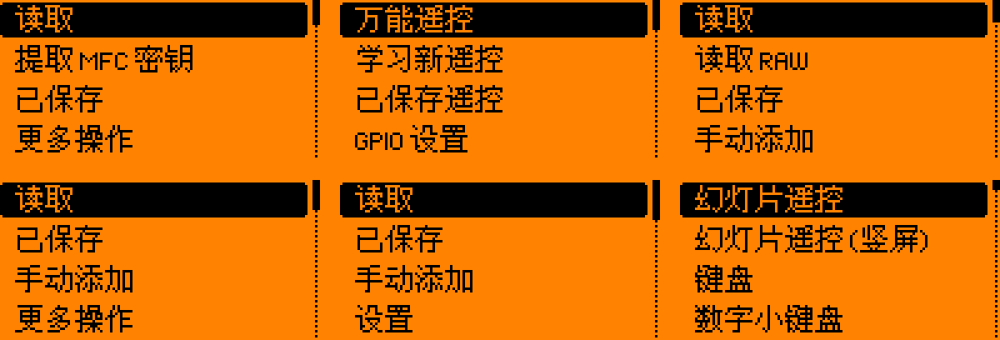

# 中文与功能并集：第二轮实现（2026-09-29）

本文件是第二轮历史记录。后续已实现手机 GPS/网络处理端，并改用 SD 字库缓解固件空间限制；最新范围、限制及预览见 [第三轮记录](COMPANION_AND_CHINESE_20260929.md)。

这一轮接在 `b8e1f9f4` 之后。已经补入可编译的功能和中文排版修复，但**尚未达到两个项目全部功能的完整并集或所有页面中文覆盖**。本文件记录本轮，上一轮的协议融合见 [UPSTREAM_FUSION.md](UPSTREAM_FUSION.md)，验证结果见 [VALIDATION.md](VALIDATION.md)。

## 本机功能

| 新增或改进 | 使用方式与变化 |
| --- | --- |
| 快捷设置 | 在锁定菜单中长按确定键打开；可调整亮度、音量和振动。亮度和音量各 21 档（0–100%，每档 5%），调整时立即生效，离开该项或页面时保存；振动切换后立即保存。原有短按操作保留。 |
| 床头时钟 | 来自固定 Unleashed 源码，安装到 `apps/Tools/clock.fap`。包含时间、闹钟、秒表、亮度控制。修复视图共享状态、定时器退出、通知队列释放及设置文件中的无效闹钟时分/亮度读取。原有 Clock 快捷键仍打开原应用。 |
| 主菜单动画 | 补上 Macintosh 开窗和立体旋转过渡；只在过渡时启动动画计时，保留原样式编号与中文标签。 |
| 十个普通工具 | 番茄钟、指针时钟、数码管时钟、日历、子网计算器（离线 IPv4/VLSM）、多人计数器（四个独立计数）、SD 卡信息、秒表、任务计时器、FlipNote记事本（文本编辑器）。保留原有作者信息和许可证，补中文并处理本固件的接口差异。 |
| 日历正确性 | 修正世纪年份的星期计算，月历扩为六周，避免遗漏 30/31 日；月份选择增加反色选框。实际 C 绘制与日期函数对照 Python 日期库检查 7,296 个月份。 |
| 数码管时钟退出 | 校验读取的小时、分钟和亮度；退出前停止定时器、移除视图并等待通知队列消费完，避免卸载后访问应用内存。输入队列满时不阻塞 GUI。 |

十个工具的固定来源是 [all-the-plugins 26sep2026](https://github.com/xMasterX/all-the-plugins/tree/eb87c158c7dbc930d74c3ae3ccb6b59cad5fc833)。原始导入文件哈希见 `applications/union/UPSTREAM.json`；之后的翻译、兼容修复和资源重命名由本仓库 Git 记录。没有把整个第三方子模块强行替换成另一套版本。

## 中文显示

- 补入主应用、桌面、锁屏、蓝牙配对、文件/存储错误、加载器、电源、升级器、HID 遥控与脚本兼容确认等文案。
- USB/蓝牙遥控的键盘、鼠标、演示、媒体和通话帮助使用中文。按键码、快捷键、协议、应用 ID、存储路径和品牌名称保留。
- 通用按钮为中文增加背景高度；文本输入和数字输入标题调整基线；滚动说明按完整 UTF-8 字符换行，并按实际行高计算底部和滚动范围。
- 应用显示名称支持 UTF-8。已有 ASCII 应用清单的二进制格式和截断行为保持；非 ASCII 名称最多 31 个 UTF-8 字节，超出时构建失败，不会自动截断汉字。清单读取和生成明确使用 UTF-8，避免中文 Windows 默认编码导致构建失败。
- 正常固件使用 696 个 CJK 字形、18,973 字节的子集；升级器单独使用 135 个 CJK 字形、3,707 字节的子集。ASCII 继续使用原字体，不在回退字库重复占空间。
- 字库收集范围扩展至原生、系统、服务、外部、额外及用户应用的 C/C++ 源码与清单中的静态名称。字形来自原文泉驿字体，像素和许可证保留。

以下是由源码标签与实际字形生成的**源码布局预览，不是真机截图**；没有把它们当成全部动态页面、主题或操作的验收。从左至右依次为 NFC、红外、Sub-GHz、低频 RFID、iButton、HID 遥控。完整 HTML 画廊由 `scripts/render_native_zh_preview.py` 生成，并随 CI 预览附件保存。



## 手机端衔接

手机在 SD 卡上发现床头时钟、十个工具或两个 HID 遥控应用（USB 遥控器、蓝牙遥控器）时，按 13 个固定完整路径显示中文名称与功能介绍。启动仍使用发现的完整 `.fap` 路径，中文名不会替换启动参数。未安装的应用不会因映射存在而假装已安装。同名文件放在其他目录时不套用这份说明。

本轮代码 `6017530b` 的 89 项 Swift 核心测试、5 项 iPhone UI 测试和模拟器构建通过，原始截图共 22 张。下图为 iPhone 17 Pro Max / iOS 26.5 的功能页离线截图，直接取自 CI 附件、未修改像素。模拟器没有可用蓝牙，画面中的“蓝牙不可用”不是真机连接结果；未连接设备时不会列出上述已安装工具。这张截图展示已有页面，本轮手机变化主要是应用名称和说明映射。

[查看手机功能页原始截图](iphone-functions-20260929.png) · [查看本轮测试、固件和全部截图附件](VALIDATION.md)

本轮没有实现 iPhone 的 GPS/网络代理处理端，没有识别 AIO 1.4 的具体硬件，也没有进行蓝牙真机联调。此前离线 Classic 样本分析、字典整理和串口接收的实现与验证边界不变。

## 如何核对并集与中文遗漏

`scripts/audit_app_union.py` 不执行应用清单，按静态 `appid` 比较。结果见 [UPSTREAM_APP_UNION.json](UPSTREAM_APP_UNION.json)：当前各应用目录共 477 个静态 ID，参考集合 421 个，重合 224 个，参考集合有 197 个 ID 在当前目录未找到。**这些包括元包、插件、改名和待审查应用，不等于 197 个缺失功能，也不等于已经融合的功能数。** 动态声明单列，嵌套 Git 子模块内容需另外核对。

```sh
python3 scripts/audit_app_union.py \
  --reference /path/to/all-the-plugins-at-eb87c158 \
  --reference-commit eb87c158c7dbc930d74c3ae3ccb6b59cad5fc833 \
  --output /tmp/app-union.json
python3 scripts/audit_ui_strings.py --output /tmp/ui-inventory.json
```

UI 审计核对 48 个 GUI 函数签名，列出中文、待审查、符号/数字和动态参数。它不会跟踪任意自定义绘制、位图文字或全部字符串拼接，因此**不能把统计比例当成中文覆盖率**。CI 保存完整清单；第三方应用仍存在大量英文，PTT 像素图中的英文提示等也未全部替换。

## 仍未完成

1. 全部外部应用、不同版本的同名应用和剩余上游差异尚未逐项适配，不能称为完整并集。
2. 动态说明、第三方界面和位图文字尚未全部中文化；没有中文输入法、任意汉字字库或运行时语言切换。
3. 日历按默认字体排版；主题替换成更大字体后的六周显示尚未验证。上游年份选择器的极端整数边界未重写。
4. 没有完成实卡、射频、蓝牙、AIO、刷机恢复或长期运行验收。没有新增定向 Wi-Fi 强制断链控制。
5. 主固件接近当前无线栈保留区域，打包边界检查必须保留。不要用链接器显示的 `.free_flash` 当作可用于主固件的全部剩余空间。

## 协作与审核

按本轮用户指定，通过本地 CLI 完成六项 `claude-opus-5-5 --effort max` 实现任务：时钟移植、系统文案、UI 审计器、十工具中文化、HID/JS 文案、日历/数码管时钟修复；另完成一项只读文档事实核对，修正工具名称、13 项映射构成及设置保存时机的表述。七项均实际返回 `claude-opus-5-5` 且正常退出；没有静默换模型。

主助手审核后另外修复布局、定时器和通知生命周期、图标冲突、CJK 滚动、清单编码、字库体积及构建问题，并独立执行测试。模型完成任务不代表验收通过。脱敏后的任务完成记录和文件哈希见 `UNION_CHINESE_CONTINUATION.json`；原始模型日志和本机配置不上传。
